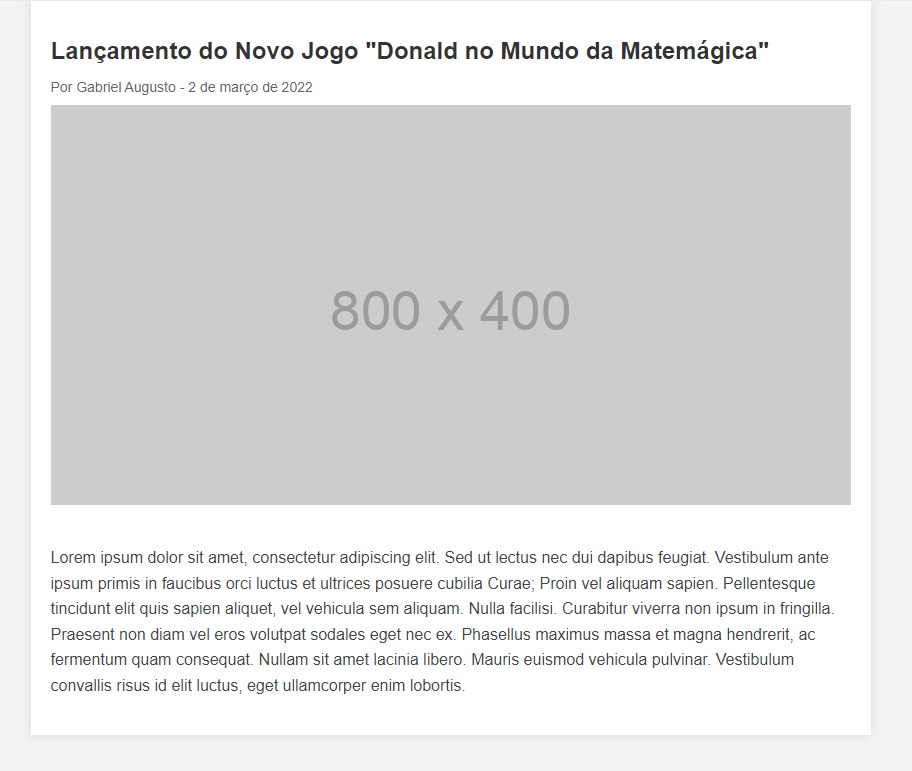
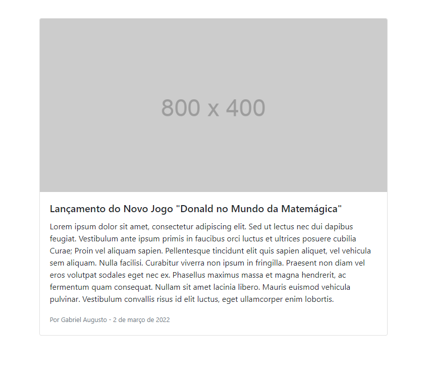
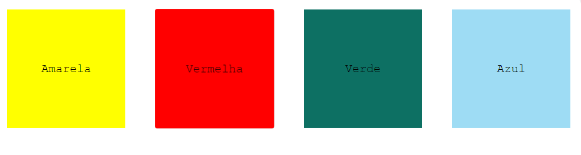
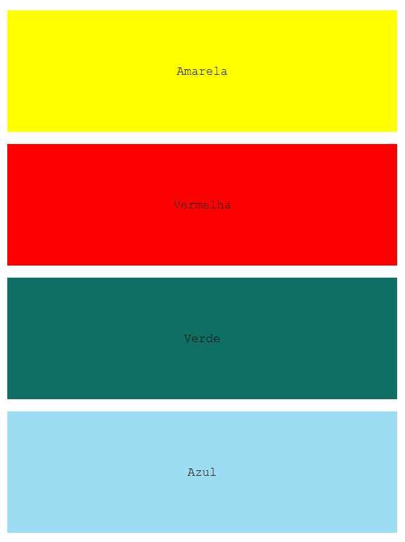
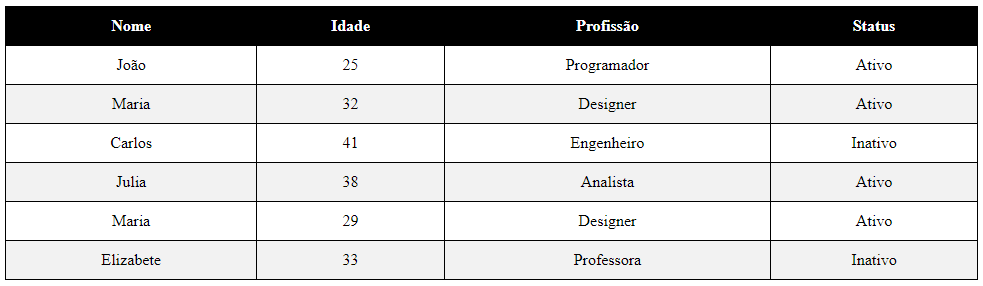

<h1> Estudo de Correção com CSS e BootStrap </h1>
Exercício com o intuito de planjear e criar uma ambiente de exploração para alunos novos na tecnologia HTML, CSS e frameworks. Apresentando ao usuário como a tela final deve ser, e apresentando a estrutura básica, com pontos de CSS faltando.

## Telas Protótipo

- Tela de Notícias

- Tela de Notícias BootStrap

- Tela de Responsividade

- Tela de Tabela

